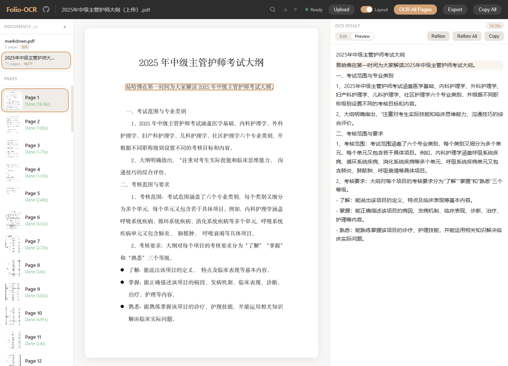

# Folio-OCR

基于 [GLM-OCR](https://huggingface.co/zai-org/GLM-OCR) + [Ollama](https://ollama.com/) 的三栏文档 OCR 工作台，专为书籍和文档的日常批量识别设计。

> **2026-06-18 · v3.4.0 已发布**：新增 `folio-ocr` 命令、`uvx` 启动、GitHub Release 包构建、License、CI 和长 PDF 超时配置。查看 [Release Notes](https://github.com/vorojar/Folio-OCR/releases/tag/v3.4.0)。

    [](https://vorojar.github.io/Folio-OCR/)



视频演示：先看 [B 站 1 分钟真实运行视频](https://www.bilibili.com/video/BV17LFpzrEpW)，快速理解“上传扫描件 → 本地 OCR → 可编辑/可导出”的完整流程。

在线体验：打开 [互动 Demo](https://vorojar.github.io/Folio-OCR/demo.html)，用内置样例查看“扫描页 → OCR → Markdown/Word/EPUB”的交互流程。

## 30 秒看懂

Folio-OCR 解决的是一个很具体的问题：把扫描 PDF、书籍照片、试卷和文档图片批量转成可编辑文本，并尽量保留标题、正文、表格和导出结构。它默认本地运行，文档不需要上传到第三方 OCR 服务。

- **输入**：PDF、PNG、JPG、GIF、BMP，可混合批量上传。
- **处理**：PP-DocLayoutV3 做版面分区，GLM-OCR 通过 Ollama 做视觉 OCR。
- **输出**：Markdown、TXT、Word `.docx`、EPUB。
- **适合**：书籍数字化、扫描件整理、表格文档转写、离线/隐私敏感 OCR。

## 快速开始

### 方式一：uvx / pipx 直接运行

适合已经安装 Python 和 Ollama 的用户，不需要手动 clone 仓库：

```bash
ollama pull glm-ocr
uvx --from git+https://github.com/vorojar/Folio-OCR folio-ocr
```

然后打开浏览器访问：http://localhost:3000

也可以用 pipx：

```bash
pipx run --spec git+https://github.com/vorojar/Folio-OCR folio-ocr
```

### 方式二：Docker Compose 一键部署

适合想把 Ollama 和 Folio-OCR 一起放进容器的用户：

```bash
git clone https://github.com/vorojar/Folio-OCR.git
cd Folio-OCR
docker compose up -d
docker compose exec ollama ollama pull glm-ocr
```

完成后打开浏览器访问：http://localhost:3000

> 有 NVIDIA 显卡？编辑 `docker-compose.yml`，取消 `deploy:` 段落的注释即可启用 GPU 加速。

## 功能特性

### OCR 核心
- 支持多种图片格式：PNG、JPG、GIF、BMP
- 支持 PDF 文件（PyMuPDF 2x 高分辨率拆页）
- 多文件混合上传（图片 + PDF 混选）
- 版面分析（Layout Detection）自动分区识别
- 相邻文本区域智能合并，减少 OCR 调用次数（11 区域 → 3 组，2.5x 加速）
- LaTeX 特殊字符自动转 Unicode（`$\textcircled{1}$` → `①`）
- 模型输出自动清理 ` ```markdown ``` ` 围栏

### 批量处理
- 一键「OCR All Pages」批量识别全部页面
- 实时进度条 + ETA 时间估算
- 随时可停（Stop 按钮立即中断当前请求）
- 选中页面时自动预识别下一页（Pre-OCR）

### 编辑与导出
- Edit / Preview 双模式切换
- Preview 模式原生渲染 HTML 表格和 Markdown
- 段落重排（Reflow）：合并因换行断开的段落
- 导出四种格式：`.md`（Markdown）、`.txt`（纯文本）、`.docx`（Word）、`.epub`（电子书）
- DOCX 导出基于 python-docx，真实 Word 文档，含分节符和页码
- 单页/全文一键复制

### 数据持久化
- SQLite 数据库（`folio_ocr.db`），文档和 OCR 结果服务重启不丢失
- 编辑内容 800ms 防抖自动保存
- 页面加载时自动恢复上次打开的文档
- 多文档管理：左侧面板上方文档列表，支持切换和删除

### 界面交互
- 三栏布局：页面缩略图 | 图片预览 | OCR 结果
- 右侧面板可拖拽调整宽度
- SSE 流式上传，逐页实时加载
- 版面区域双向高亮（点击图片框 ↔ 点击文本块）
- 全文搜索（Ctrl+F），跨页高亮 + 命中计数
- 键盘导航（↑↓ 切换页面）
- 暖色奶油/炭灰主题，中文字体适配

### 网络容错
- 所有网络请求带超时保护（按场景分档：5s ~ 300s）
- Toast 弹窗通知：保存失败、OCR 超时、加载错误等即时反馈
- Ollama 断开后 UI 不会冻住，超时后自动恢复可操作状态

## Docker 常用命令

默认数据会保存到 Docker volume，重启服务不会丢失文档和 OCR 结果：

```bash
docker compose down          # 停止服务
docker compose up -d         # 重新启动（数据不会丢失）
docker compose logs -f app   # 查看应用日志
docker compose logs -f ollama # 查看 Ollama 日志
```

默认配置会让版面分析模型跑在 CPU 上，把 GPU 显存优先留给 Ollama。需要调整时可设置：

```bash
LAYOUT_DEVICE=cpu   # 默认值，最稳妥
LAYOUT_DEVICE=auto  # 有 CUDA 时自动把版面分析模型放到 GPU
LAYOUT_DEVICE=cuda  # 强制使用 CUDA，不可用时启动失败
```

Folio-OCR 默认会给 Ollama 请求传入 `OLLAMA_NUM_CTX=16384`，避免 GLM-OCR 处理图片时因上下文太小触发底层 RoPE / KV cache 错误。内存非常紧张时可以调小，复杂图片或高分辨率扫描件建议保持默认或调大。

如果遇到模型输出过长或重复内容，可通过 `OLLAMA_NUM_PREDICT` 限制单次 OCR 输出长度。默认值为 `4096`，短文档 demo 或低显存机器可以适当调小。

---

## 从源码运行

### 环境要求

- Python 3.10-3.12（推荐 3.11）
- [Ollama](https://ollama.com/) 已安装且 `ollama` 在 PATH 中

### 安装和启动

```bash
# 安装依赖
pip install -r requirements.txt

# 拉取模型
ollama pull glm-ocr

# 启动服务
python server.py

# 或使用热重载开发
uvicorn folio_ocr.server:app --reload --host 0.0.0.0 --port 3000

# Windows 一键启动
start.bat
```

服务启动后访问：http://localhost:3000

## 配置项

| 变量 | 默认值 | 说明 |
|------|--------|------|
| `OLLAMA_BASE` | `http://localhost:11434` | Ollama 服务地址 |
| `OLLAMA_MODEL` | `glm-ocr` | OCR 模型名 |
| `OLLAMA_NUM_CTX` | `16384` | 传给 Ollama `/api/chat` 的上下文窗口 |
| `OLLAMA_NUM_PREDICT` | `4096` | 传给 Ollama `/api/chat` 的最大输出 token 数 |
| `OCR_REQUEST_TIMEOUT_MS` | `300000` | 前端 OCR 请求超时，长 PDF 或慢 GPU 可调大 |
| `LAYOUT_DEVICE` | `cpu` | 版面分析设备：`cpu`、`cuda`、`auto` |
| `DB_PATH` | `./folio_ocr.db` | SQLite 数据库路径 |
| `UPLOAD_DIR` | `./uploads` | 上传文件和 PDF 拆页目录 |
| `HOST` | `0.0.0.0` | `folio-ocr` 命令启动时监听地址 |
| `PORT` | `3000` | `folio-ocr` 命令启动时监听端口 |

## 项目结构

```
Folio-OCR/
├── folio_ocr/
│   ├── server.py          # FastAPI 后端
│   ├── index.html         # 应用页面
│   ├── script.js          # 前端逻辑
│   ├── style.css          # 样式
│   └── latex_unicode.json # LaTeX → Unicode 映射表
├── server.py              # 兼容入口：python server.py
├── pyproject.toml         # Python 包元数据和 folio-ocr 命令
├── requirements.txt       # Python 依赖
├── Dockerfile             # Docker 镜像构建
├── docker-compose.yml     # Docker Compose 编排
├── scripts/verify.sh      # 本地/CI 验证入口
├── docs/                  # GitHub Pages 首页
├── folio_ocr.db           # SQLite 数据库（运行时生成）
└── uploads/               # 上传文件目录（运行时生成）
```

## API 端点

| 方法 | 路径 | 说明 |
|------|------|------|
| GET | `/api/status` | 服务状态、Ollama 连通性 |
| POST | `/api/load-model` | 启动 Ollama 并预热模型 |
| POST | `/api/upload` | 上传文件，返回 SSE 页面流 |
| GET | `/api/images/{doc_id}/{filename}` | 获取页面图片 |
| POST | `/api/ocr/{doc_id}/{page_num}` | 单页 OCR |
| POST | `/api/export/{doc_id}` | 导出 DOCX |
| POST | `/api/export/{doc_id}/epub` | 导出 EPUB |
| GET | `/api/documents` | 列出所有文档 |
| GET | `/api/documents/{doc_id}` | 获取文档详情（含所有页面） |
| DELETE | `/api/documents/{doc_id}` | 删除文档 |
| PUT | `/api/pages/{doc_id}/{page_num}/text` | 保存编辑后的文本 |

## 性能参考

- 模型冷启动首次请求：~50s
- 后续单页识别：~0.5s
- PDF 以 2x 缩放矩阵渲染，保证 OCR 质量

## 常见问题

### Ollama 报 `model failed to load`

这通常是 Ollama 侧模型没有成功加载，常见原因是模型未拉取、内存/显存不足，或 GPU 资源被其他进程占用。

排查顺序：

```bash
docker compose exec ollama ollama pull glm-ocr
docker compose logs -f ollama
```

如果本地源码运行时遇到显存紧张，保持默认的 `LAYOUT_DEVICE=cpu`，让版面分析模型使用 CPU，把 GPU 留给 Ollama。若已经设置过 `LAYOUT_DEVICE=auto` 或 `LAYOUT_DEVICE=cuda`，可以改回：

```bash
LAYOUT_DEVICE=cpu python server.py
```

### Ollama 报 `GGML_ASSERT(a->ne[2] * 4 == b->ne[0]) failed`

这是 GLM-OCR / Ollama 在图片 OCR 时可能触发的底层上下文错误。Folio-OCR 从 v3.3.1 起默认给 `/api/chat` 请求设置：

```json
{
  "options": {
    "num_ctx": 16384
  }
}
```

如果仍然复现，可以尝试调大上下文或降低输入图片分辨率：

```bash
OLLAMA_NUM_CTX=24576 python server.py
```

### Ollama v0.30.6 处理 PDF 超时

如果约 1 MB 的 PDF 在较新 Ollama 版本上超时，先确认是浏览器请求超时还是 Ollama runner 卡住：

```bash
docker compose logs -f app
docker compose logs -f ollama
```

Folio-OCR 默认已把前端 OCR 请求超时提高到 300 秒。慢机器或大页 PDF 可以继续调大：

```bash
OCR_REQUEST_TIMEOUT_MS=600000 python server.py
```

Docker 用户可以临时切换 Ollama 镜像版本做兼容性验证：

```bash
OLLAMA_VERSION=0.19.0 docker compose up -d
docker compose exec ollama ollama pull glm-ocr
```

### 单次最多能处理多少张图片？

Folio-OCR 没有写死单次页数上限；上传的图片和 PDF 页会按顺序写入 SQLite 和 `uploads/`，OCR 也是逐页执行。实际上限主要取决于磁盘空间、浏览器页面数量和 Ollama 的稳定性。大文档建议先按 20-50 页一批处理，确认环境稳定后再扩大批量。

## License

MIT
